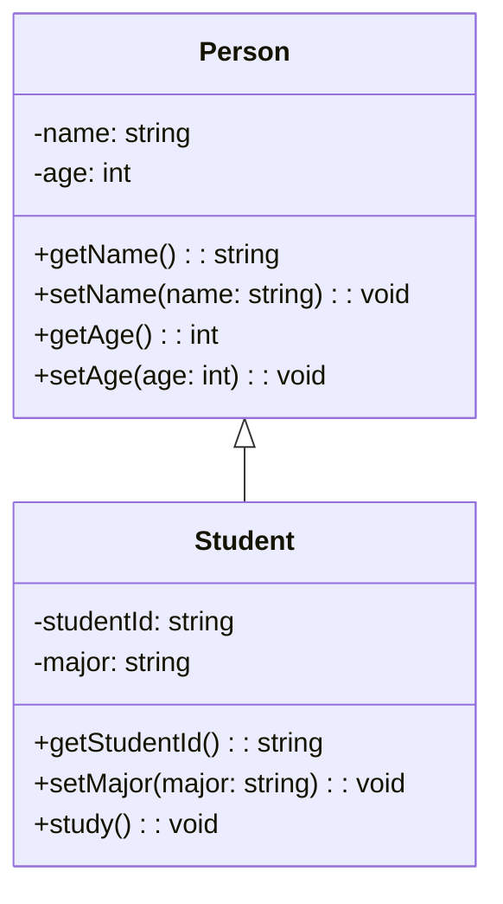
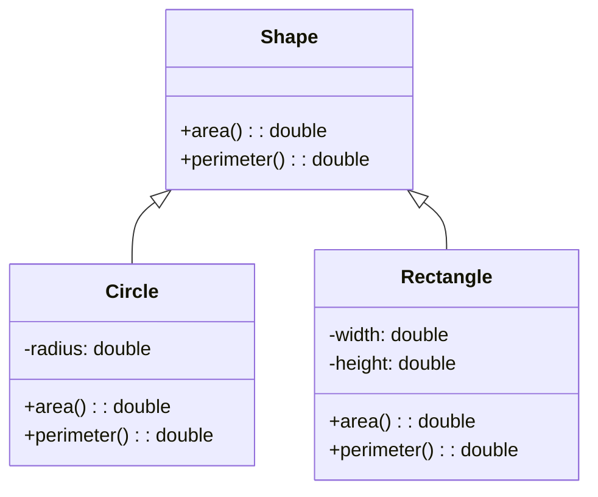
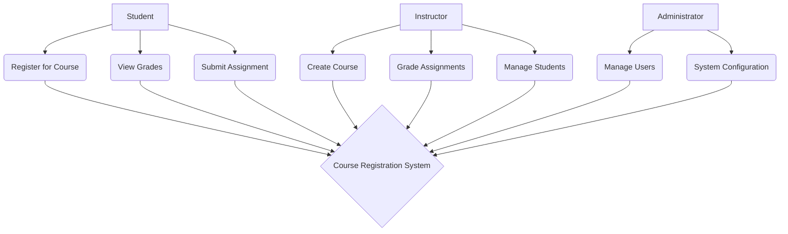

# Week 1: Introduction to Object-Oriented Analysis & Design

## Learning Objectives

- Understand the fundamentals of Object-Oriented Analysis and Design (OOAD)
- Learn the difference between analysis and design phases
- Introduction to UML and its importance in OOAD
- Understand the software development lifecycle in OO context

## What is Object-Oriented Analysis and Design?

**Object-Oriented Analysis (OOA)** is the process of identifying and defining the objects, classes, and their relationships in a system from a problem domain perspective.

**Object-Oriented Design (OOD)** is the process of defining the solution architecture, including classes, objects, methods, and their interactions from an implementation perspective.

## The Software Development Lifecycle in OO Context

### Traditional vs Object-Oriented Approach

**Traditional Approach:**
1. Requirements Gathering
2. Analysis
3. Design
4. Implementation
5. Testing
6. Deployment

**Object-Oriented Approach:**
1. Requirements Gathering
2. Object-Oriented Analysis (OOA)
3. Object-Oriented Design (OOD)
4. Implementation
5. Testing
6. Deployment

### Why Object-Oriented?

1. **Modularity**: Systems are divided into smaller, manageable objects
2. **Reusability**: Objects can be reused across different systems
3. **Maintainability**: Changes are localized to specific objects
4. **Extensibility**: New features can be added by extending existing objects
5. **Real-world modeling**: OO concepts map naturally to real-world entities

## Key Concepts in OOAD

### 1. Objects and Classes

**Object**: An instance of a class that has state and behavior
**Class**: A blueprint or template that defines the properties and methods of objects



### 2. Encapsulation

The bundling of data and methods that operate on that data within a single unit (class).

```javascript
class BankAccount {
    constructor(accountNumber, balance) {
        this.accountNumber = accountNumber;
        this.balance = balance;
    }

    // Public methods
    deposit(amount) {
        if (amount > 0) {
            this.balance += amount;
        }
    }

    withdraw(amount) {
        if (amount > 0 && amount <= this.balance) {
            this.balance -= amount;
        }
    }

    getBalance() {
        return this.balance;
    }
}
```

### 3. Inheritance

The mechanism by which a class can inherit properties and methods from a parent class.



### 4. Polymorphism

The ability of objects to take on different forms or respond differently to the same method call.

```javascript
class Animal {
    makeSound() {
        return "Some generic animal sound";
    }
}

class Dog extends Animal {
    makeSound() {
        return "Woof!";
    }
}

class Cat extends Animal {
    makeSound() {
        return "Meow!";
    }
}

// Polymorphic behavior
const animals = [new Dog(), new Cat(), new Animal()];

animals.forEach(animal => {
    console.log(animal.makeSound());
});
```

### 5. Abstraction

The process of hiding complex implementation details and showing only the essential features.

```javascript
class DatabaseConnection {
    connect() {
        // Complex connection logic hidden
        console.log("Connected to database");
    }

    query(sql) {
        // Complex query execution hidden
        return "Query results";
    }

    disconnect() {
        // Complex disconnection logic hidden
        console.log("Disconnected from database");
    }
}

// Client code only sees the simple interface
const db = new DatabaseConnection();
db.connect();
db.query("SELECT * FROM users");
db.disconnect();
```

## UML (Unified Modeling Language)

UML is the standard language for visualizing, specifying, constructing, and documenting the artifacts of software systems.

### Types of UML Diagrams

1. **Structural Diagrams**
   - Class Diagram
   - Object Diagram
   - Package Diagram
   - Deployment Diagram
   - Component Diagram

2. **Behavioral Diagrams**
   - Use Case Diagram
   - Activity Diagram
   - State Diagram
   - Sequence Diagram
   - Communication Diagram

### Example: Use Case Diagram



## OOAD Process

### 1. Requirements Gathering
- Identify stakeholders
- Collect functional and non-functional requirements
- Create use case diagrams

### 2. Object-Oriented Analysis
- Identify classes and objects
- Define relationships between classes
- Create conceptual model
- Document use cases

### 3. Object-Oriented Design
- Refine the analysis model
- Add implementation details
- Design class interfaces
- Plan testing strategy

### 4. Implementation
- Code the classes
- Implement relationships
- Test individual components
- Integration testing

## Best Practices in OOAD

1. **SOLID Principles**
   - Single Responsibility Principle
   - Open/Closed Principle
   - Liskov Substitution Principle
   - Interface Segregation Principle
   - Dependency Inversion Principle

2. **Design Patterns**
   - Creational patterns (Factory, Singleton, Builder)
   - Structural patterns (Adapter, Decorator, Facade)
   - Behavioral patterns (Observer, Strategy, Command)

3. **Documentation**
   - Keep UML diagrams up to date
   - Document design decisions
   - Maintain clear class interfaces

## Next Week

In the next lecture, we'll dive deeper into UML modeling and start creating detailed class diagrams for real-world systems.

## References

- [UML Specification](https://www.omg.org/spec/UML/)
- [Design Patterns Book](https://en.wikipedia.org/wiki/Design_Patterns)
- [OOAD Best Practices](https://martinfowler.com/)
