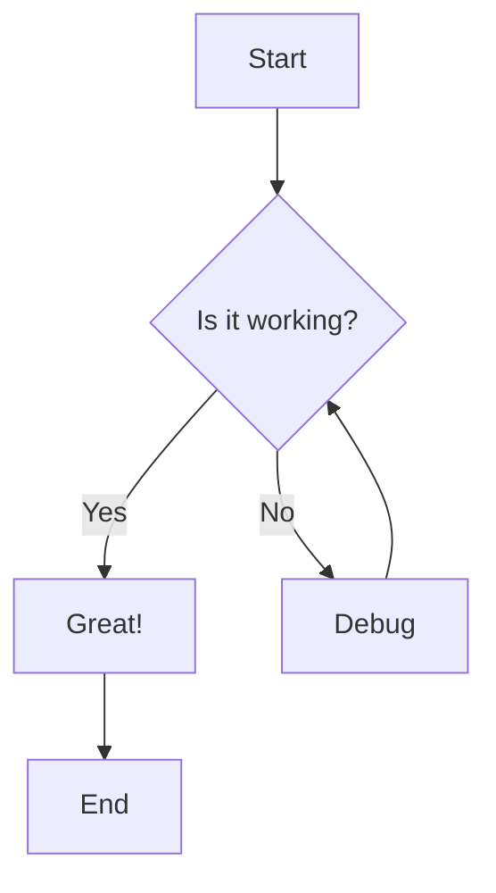
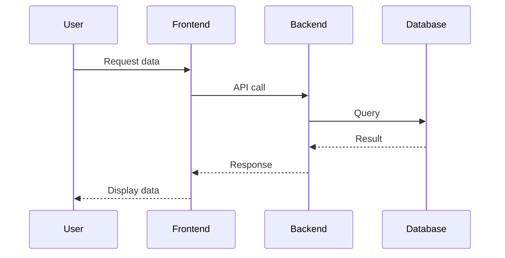
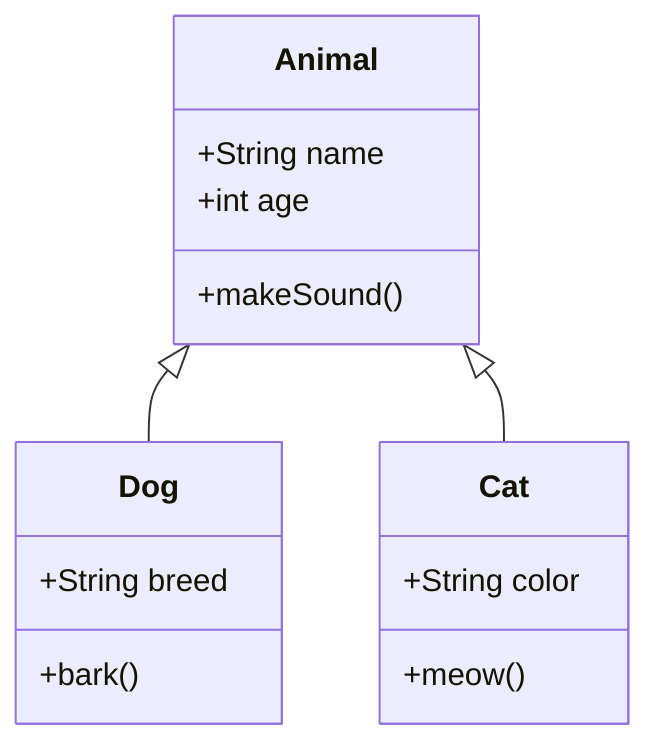
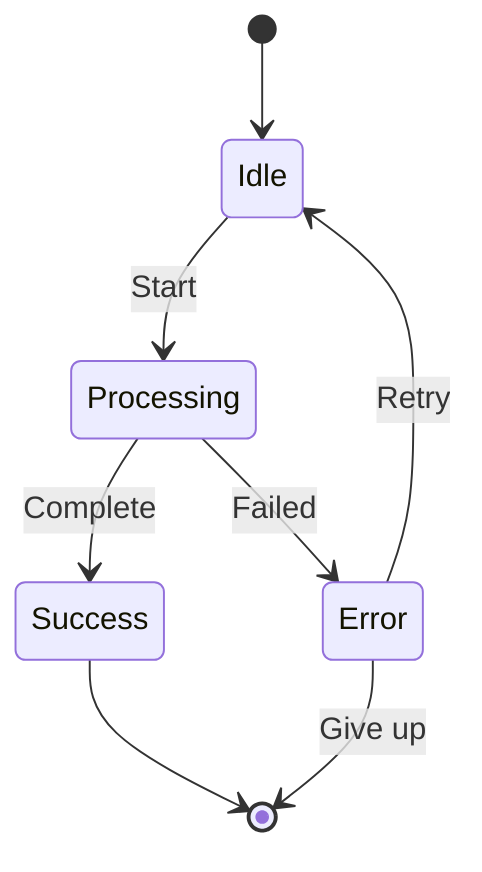
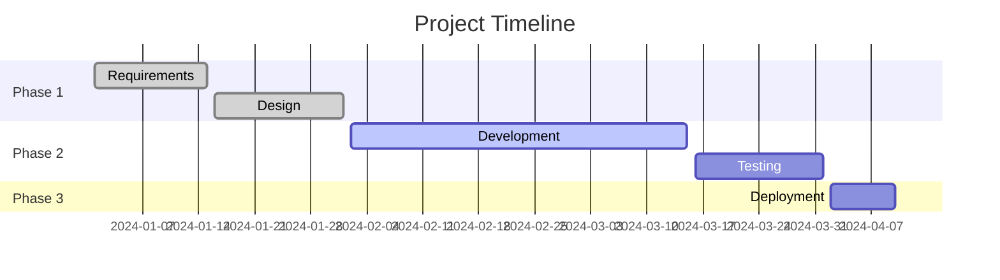
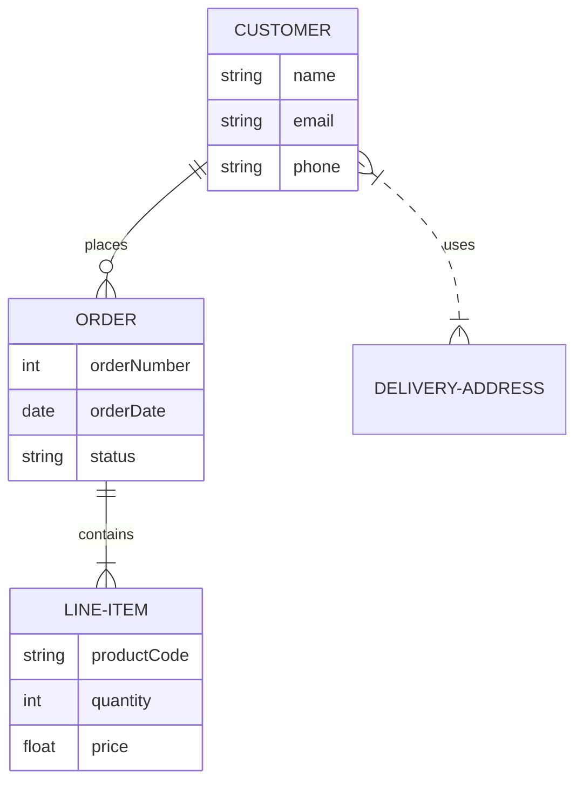
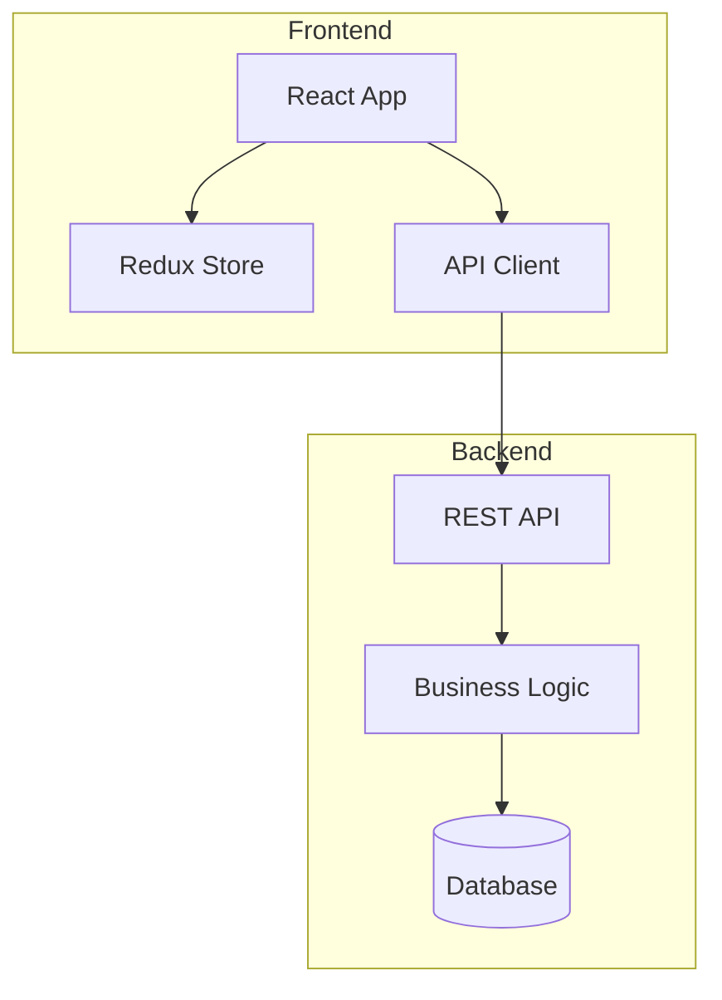
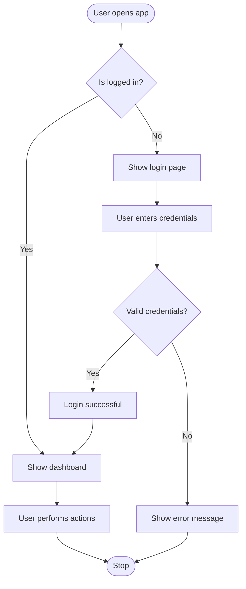

# Diagrams Demo

This page demonstrates how to use Mermaid and PlantUML diagrams in Docusaurus.

## Mermaid Diagrams

Mermaid is now supported with the official `@docusaurus/theme-mermaid` theme!

### Flow Chart

### Sequence Diagram

### Class Diagram

### State Diagram

### Gantt Chart

### Entity Relationship Diagram

## PlantUML Diagrams

PlantUML can be used by embedding images from PlantUML server or using external tools.

### Option 1: Using PlantUML Server

You can generate diagrams using the [PlantUML Web Server](http://www.plantuml.com/plantuml/uml/):

### Option 2: Embed PlantUML as Images

Create your diagram at [PlantUML Editor](https://www.plantuml.com/plantuml/uml/) and embed the image URL.

### Option 3: Use Mermaid Alternative

For many UML diagrams, Mermaid provides excellent alternatives:

#### Component-like Diagram with Mermaid

#### User Flow Diagram

## Tips for Using Diagrams

### Mermaid Tips

1. **Syntax**: Use triple backticks with `mermaid` language identifier
2. **Live Preview**: Diagrams render automatically in development
3. **Theming**: Mermaid diagrams adapt to light/dark mode
4. **Documentation**: [Mermaid Official Docs](https://mermaid.js.org/)

### PlantUML Tips

1. **External Server**: Use PlantUML web server to generate diagram URLs
2. **Image Embedding**: Embed generated diagram images in your docs
3. **Local Tools**: Use PlantUML desktop tools for complex diagrams
4. **Documentation**: [PlantUML Official Site](https://plantuml.com/)
5. **Mermaid Alternative**: Consider using Mermaid for most diagram needs

### Best Practices

✅ **Do:**
- Keep diagrams simple and focused
- Use meaningful labels and descriptions
- Test diagrams in both light and dark modes
- Add comments to explain complex parts

❌ **Don't:**
- Create overly complex diagrams
- Use tiny font sizes
- Forget to test diagram rendering
- Mix too many concepts in one diagram

## Performance Considerations

- **Mermaid**: Rendered client-side, fast and responsive
- **PlantUML Images**: Pre-generated, fast loading
- **Large diagrams**: Consider splitting into multiple smaller diagrams
- **Build time**: Mermaid diagrams are compiled during build

## Troubleshooting

### Mermaid not rendering?

1. Check syntax errors in your diagram code
2. Verify `@docusaurus/theme-mermaid` is in themes array
3. Ensure `markdown.mermaid: true` is set in config
4. Clear cache: `pnpm clear` and rebuild

### PlantUML images not showing?

1. Check if the PlantUML server URL is accessible
2. Verify the diagram syntax is correct
3. Try regenerating the diagram URL
4. Consider using local PlantUML installation for offline work

## Learn More

- [Docusaurus Mermaid Documentation](https://docusaurus.io/docs/markdown-features/diagrams)
- [Mermaid Live Editor](https://mermaid.live/)
- [PlantUML Web Server](http://www.plantuml.com/plantuml/uml/)

